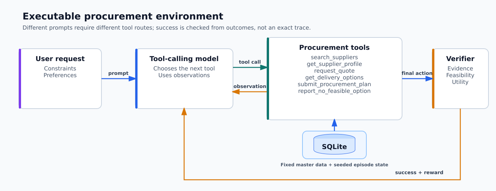

# Multilingual procurement tool calling

Published models and experiment artifacts are collected on
[Hugging Face](https://huggingface.co/collections/rubenbalbastre/2b-tool-calling-using-sft).

## Project description

This project explores how supervised fine-tuning can improve a small language
model's ability to use tools reliably. The target task is stateful, multi-turn
procurement: a model must decide which information it needs, call the
appropriate functions, use returned values in later calls, and finish with a
valid purchasing decision.

The purpose of fine-tuning is not to teach one fixed workflow. It is to improve
the model's ability to select different tool routes from the user's constraints,
preserve arguments across turns, recover from tool errors, and make a grounded
decision from the evidence it has collected. Task success is measured by the
executable environment alongside token-level validation loss.

The same verifiable environment generates successful supervised trajectories
and evaluates unseen model rollouts. This keeps data creation lightweight while
ensuring that every training trace has been executed and checked against the
task constraints.

The project connects the complete experimentation loop:

```text
seeded scenarios → verified multilingual trajectories → LoRA SFT
       ↓                                               ↓
SQLite environment ← tool calls ← model evaluation and verification
```

## Fine-tuned models

The current main experiment fine-tunes
[`google/gemma-4-E2B-it`](https://huggingface.co/google/gemma-4-E2B-it)
with LoRA supervised fine-tuning on the generated multilingual tool
trajectories.

| Experiment | Base model | Method | Status |
| --- | --- | --- | --- |
| [`gemma-4-E2B-it-sft`](https://huggingface.co/rubenbalbastre/procurement-function-calling-gemma-4-E2B-it-sft) | `google/gemma-4-E2B-it` | LoRA SFT | Experimental |

## Results

Every run evaluates **all 400 scenario–prompt pairs** in the held-out `test`
split, including **unseen templates 16–25**. All runs use the same seed and test examples;
variation comes from repeated inference. Values are the mean ± sample standard
deviation across runs.

| Model | Thinking | Runs | Training tokens | Task success | Average return | Mean episode latency |
| --- | --- | ---: | ---: | ---: | ---: | ---: |
| Base | Disabled | 3 | — | 16.58% ± 0.29 pp | 0.230 ± 0.010 | 15.75 ± 0.14 s |
| Base | Enabled | 3 | — | 40.33% ± 1.66 pp | 0.476 ± 0.017 | 95.36 ± 2.04 s |
| LoRA SFT (48 steps) | Disabled | 3 | **1.47M** | **42.50% ± 0.35 pp** | **0.567 ± 0.005** | **20.31 ± 0.19 s** |

Training processed **1,472,140 non-padding input tokens** across **384
examples**. Of these, **188,297 assistant tool-call tokens** carried loss; context and tool-result
tokens were masked from the loss. The 48-step SFT job took **65 minutes on one
NVIDIA A40 GPU**.

Task-level cells report `mean success ± SD / mean return ± SD`.

| Model | Thinking | Compliance first | Direct supplier | No feasible option | Open search | Preferred with fallback |
| --- | --- | ---: | ---: | ---: | ---: | ---: |
| Base | Disabled | 38.75% ± 1.25 pp / 0.492 ± 0.023 | 21.67% ± 0.72 pp / 0.259 ± 0.012 | 0% ± 0 pp / -0.059 ± 0.003 | 20.42% ± 1.44 pp / 0.441 ± 0.012 | 2.08% ± 0.72 pp / 0.016 ± 0.006 |
| Base | Enabled | 44.17% ± 3.15 pp / 0.689 ± 0.058 | 68.75% ± 4.51 pp / 0.645 ± 0.035 | 13.33% ± 0.72 pp / 0.133 ± 0.007 | 45.42% ± 0.72 pp / 0.504 ± 0.013 | 30.00% ± 3.31 pp / 0.411 ± 0.010 |
| LoRA SFT (48 steps) | Disabled | 52.50% ± 0 pp / 0.900 ± 0.001 | 63.13% ± 0.88 pp / 0.618 ± 0.000 | 42.50% ± 0 pp / 0.413 ± 0.004 | 51.88% ± 0.88 pp / 0.669 ± 0.014 | 2.50% ± 1.77 pp / 0.236 ± 0.006 |

Against the non-thinking base, the 48-step SFT checkpoint improves mean task
success by **25.92 percentage points** and mean return by **0.338**. It also slightly
exceeds the thinking-enabled base on both metrics while using **about one fifth
of its mean episode latency**. **Preferred-supplier fallback remains the clearest
weakness: intermediate return improves, but complete task success remains low.**

| Model | Thinking | Input tokens | Output tokens | Total tokens |
| --- | --- | ---: | ---: | ---: |
| Base | Disabled | 6,596,107 ± 46,966 | 161,637 ± 937 | 6,757,744 ± 47,084 |
| Base | Enabled | 8,027,538 ± 366,261 | 993,700 ± 18,121 | 9,021,238 ± 384,314 |
| LoRA SFT (48 steps) | Disabled | 7,799,470 ± 88,576 | 168,208 ± 1,032 | 7,967,677 ± 89,607 |

Thinking increases output tokens substantially and raises mean latency by
**more than six times** over the non-thinking base. The SFT model completes more useful
tool trajectories without that reasoning-token overhead, although its longer
interactions still use more context than the non-thinking base.

These estimates remain preliminary. Each configuration has **three runs**, and the
standard deviations describe observed run-to-run inference variability; they
are not confidence intervals.

## Environment description

The environment simulates supplier selection for constrained material requests.
A model can search suppliers, inspect profiles, request quotes, retrieve delivery
options, submit a procurement plan, or report that no feasible option exists.
Tasks vary between direct supplier requests, open searches, compliance-first
decisions, preferred-supplier fallback, and infeasible cases.

Unlike a static function-calling benchmark, correctness is determined by
executing the model's actions. The verifier checks observed evidence,
constraint satisfaction, and decision quality instead of requiring one exact
gold sequence.

Supplier master data lives in SQLite. Episode-specific price, availability,
readiness, transport cost, arrival date, reliability, and emissions are derived
deterministically from a seed. This makes experiments reproducible while still
requiring the model to discover the state through tool calls. The interface
follows the familiar Gymnasium `reset`/`step` shape and uses structured tool-call
dictionaries as actions.



## Techniques used

- **Data generation:** leakage-safe Hugging Face dataset splits, verified
  reference trajectories, and multiple prompt templates in English, Spanish,
  German, and French.
- **Post-training:** assistant-only supervised loss, LoRA adapters through PEFT,
  and early stopping.
- **Evaluation:** closed-loop environment rollouts with task success, return,
  full traces, token usage, and latency—not only validation loss.
- **Inference:** local evaluation with Transformers or vLLM and remote evaluation
  with OpenAI models through the same task semantics.
- **Experiment management:** Hydra configuration, deterministic seeds, Weights &
  Biases tracking, checkpointing, and reproducible RunPod execution.
- **Tool integration:** model-specific chat templates, generated JSON schemas,
  multi-turn tool state, dynamic validation batching, and native LoRA serving in
  vLLM.

The generated training and evaluation splits are published as the
[`rubenbalbastre/supply-chain-tool-calling`](https://huggingface.co/datasets/rubenbalbastre/supply-chain-tool-calling)
dataset.

## Quick start

Run commands from the repository root with the project environment activated.

```bash
python generate_data.py
python -m src.evaluation.evaluate_local episodes=100 seed=1234
```

Run the tests:

```bash
python -m unittest discover -s tests -v
```

Use `./scripts/create-env.sh` to create `.venv` and install the declared
dependencies first.

## Entry points

| Entry point | Configuration | Purpose |
| --- | --- | --- |
| `generate_data.py` | `config/data_generation.yaml` | Create the procurement SFT and test dataset |
| `train_sft.py` | `config/train_sft.yaml` | Supervised fine-tuning |
| `python -m src.evaluation.evaluate_local` | `config/eval.yaml` | Evaluate with Transformers or an automatically managed vLLM server |
| `python -m src.evaluation.evaluate_openai` | CLI arguments | Evaluate an OpenAI model |

Hydra entry points accept command-line overrides, for example:

```bash
python generate_data.py splits.sft_train=40 splits.test=20
python -m src.evaluation.evaluate_local backend=vllm episodes=100
```

## Documentation

- [Environment and verifiable trajectories](docs/environment.md)
- [Dataset generation and Hugging Face publishing](docs/data-generation.md)
- [Supervised fine-tuning](docs/sft_training.md)
- [Local and OpenAI evaluation](docs/evaluation.md)
- [RunPod experiment environment](docs/runpod.md)

The procurement environment lives in
[`src/environment/procurement`](src/environment/procurement), and its SQLite
database is created automatically below `data/environment/`. Generated
artifacts are written below `data/` or `outputs/`.
